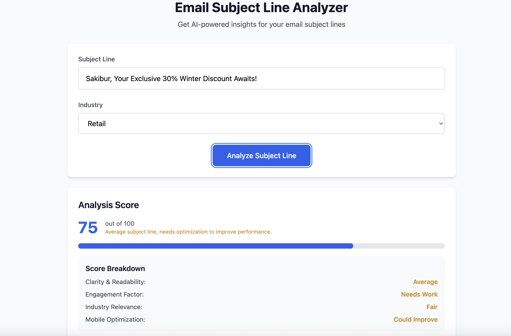

# Email Subject Line Analyzer

A full-stack web application that uses AI to analyze email subject lines and provide actionable insights for better email marketing performance.

## 🚀 Features

- **AI-Powered Analysis**: Uses OpenAI GPT-4o-mini to analyze subject lines
- **Industry-Specific Insights**: Tailored recommendations for e-commerce, SaaS, and retail industries
- **Comprehensive Scoring**: 0-100 score with detailed breakdown
- **Issue Detection**: Identifies specific problems with subject lines
- **Actionable Suggestions**: Provides alternative subject line suggestions
- **One-Click Copy**: Easy copying of suggested subject lines
- **Responsive Design**: Works on desktop and mobile devices
- **Real-time Analysis**: Fast AI-powered feedback

## 📸 Screenshots

### Main Interface


### Analysis Results


## 🏗️ Project Structure

```
markopolo-test/
├── backend/                 # Node.js/Express API server
│   ├── helpers/
│   │   └── openaiHelper.js # OpenAI integration helper
│   ├── server.js           # Main server file
│   ├── package.json        # Backend dependencies
│   └── package-lock.json   # Lock file
├── frontend/               # Frontend application
│   └── index.html          # Single-page application
└── README.md              # This file
```

## 🛠️ Technology Stack

### Backend
- **Node.js** - Runtime environment
- **Express.js** - Web framework
- **OpenAI API** - AI analysis engine
- **Joi** - Input validation
- **CORS** - Cross-origin resource sharing
- **dotenv** - Environment variable management

### Frontend
- **HTML5** - Markup
- **Tailwind CSS** - Styling framework
- **Vanilla JavaScript** - Client-side logic
- **Fetch API** - HTTP requests

## 📋 Prerequisites

- Node.js (v14 or higher)
- npm (Node Package Manager)
- OpenAI API key
- Modern web browser

## 🚀 Getting Started

### 1. Clone the Repository

```bash
git clone <repository-url>
cd markopolo-test
```

### 2. Backend Setup

```bash
# Navigate to backend directory
cd backend

# Install dependencies
npm install

# Create environment file
cp .env.example .env
```

### 3. Environment Configuration

Create a `.env` file in the `backend` directory with the following variables:

```env
OPENAI_KEY=your_openai_api_key_here
OPENAI_URL=https://api.openai.com/v1
PORT=3001
```

### 4. Start the Backend Server

```bash
# From the backend directory
npm start

# Or run directly
node server.js
```

The backend server will start on `http://localhost:3001`

### 5. Start the Frontend

```bash
# From the project root
cd frontend

# Start a local server (choose one method)
python3 -m http.server 8080
# OR
npx serve .
# OR
php -S localhost:8080
```

The frontend will be available at `http://localhost:8080`

## 🔧 API Endpoints

### POST `/api/analyze-subject`

Analyzes an email subject line and returns AI-powered insights.

**Request Body:**
```json
{
  "subject": "Your email subject line here",
  "industry": "e-commerce" | "saas" | "retail"
}
```

**Response:**
```json
{
  "original": "Original subject line",
  "score": 85,
  "issues": [
    "Subject line is too long",
    "Missing urgency words"
  ],
  "suggestions": [
    "Try: Limited Time: 50% Off Everything!",
    "Consider: Don't Miss Out - Sale Ends Soon!"
  ],
  "ai_insights": "Detailed AI analysis and recommendations..."
}
```

### GET `/health`

Health check endpoint.

**Response:**
```json
{
  "status": "OK",
  "timestamp": "2024-01-01T00:00:00.000Z"
}
```

## 🎯 Usage

1. **Open the Application**: Navigate to `http://localhost:8080`
2. **Enter Subject Line**: Type your email subject line
3. **Select Industry**: Choose from e-commerce, SaaS, or retail
4. **Analyze**: Click "Analyze Subject Line" button
5. **Review Results**: 
   - Check your score (0-100)
   - Review identified issues
   - Copy suggested improvements
   - Read AI insights

## 📊 Score Breakdown

The application provides detailed scoring across four key metrics:

- **Clarity & Readability**: How clear and easy to understand
- **Engagement Factor**: How compelling and action-oriented
- **Industry Relevance**: How well-suited for the selected industry
- **Mobile Optimization**: How well it displays on mobile devices

## 🎨 Features in Detail

### AI-Powered Analysis
- Uses OpenAI GPT-4 for intelligent subject line analysis
- Industry-specific recommendations
- Contextual insights and suggestions

### Interactive Interface
- Real-time form validation
- Loading states with animations
- Responsive design for all devices
- One-click copy functionality

### Comprehensive Feedback
- Numerical scoring (0-100)
- Detailed issue identification
- Alternative subject line suggestions
- AI-generated insights and recommendations

## 🔒 Security

- Input validation using Joi
- CORS protection
- Environment variable security
- No sensitive data stored

## 🚀 Deployment

### Backend Deployment
1. Set environment variables on your hosting platform
2. Install dependencies: `npm install`
3. Start the server: `npm start`

### Frontend Deployment
1. Upload the `index.html` file to your web server
2. Ensure the backend API URL is accessible
3. Update the API endpoint URL in the frontend if needed

## 🐛 Troubleshooting

### Common Issues

**Backend not starting:**
- Check if port 3001 is available
- Verify environment variables are set
- Ensure all dependencies are installed

**Frontend not connecting to backend:**
- Verify backend is running on port 3001
- Check CORS settings
- Ensure both servers are running

**OpenAI API errors:**
- Verify API key is correct
- Check API quota and billing
- Ensure internet connectivity

## 📝 Development

### Adding New Features
1. Backend: Add new routes in `server.js`
2. Frontend: Update `index.html` with new functionality
3. Test thoroughly before deployment

### Code Structure
- **Backend**: Express.js with middleware pattern
- **Frontend**: Vanilla JavaScript with modular functions
- **Styling**: Tailwind CSS utility classes

## 📄 License

This project is licensed under the ISC License.


---

**Built with ❤️ using Node.js, Express.js, OpenAI API, and Tailwind CSS**
